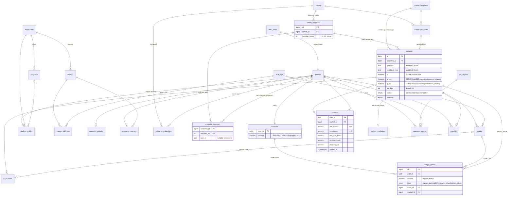

# Database

Everything that touches balances, trades, positions or resolution is SQL in
`supabase/migrations/`. The client reads tables and views under RLS and writes only through
`supabase.rpc()`.

## Entity relationships

## Tables

| Area | Table | Access | Notes |
|---|---|---|---|
| System | `app_settings` | admin | `sim_now` drives `app_now()` |
| | `audit_log` | admin | written by triggers on admin-managed tables |
| Catalog | `universities`, `programs`, `courses`, `skill_tags`, `course_skill_tags` | public | 54 fixed skill tags |
| | `job_regions` | public | closed list outcome reports resolve against |
| People | `profiles` | owner, admin | created by trigger on `auth.users`; never hard-deleted |
| | `student_profiles` | owner | university from verified email domain |
| | `transcript_uploads` | owner | PDF path, parse output, model + prompt version |
| | `transcript_courses` | owner | written only by `confirm_transcript` |
| Ledger | `accounts` | owner | balance maintained by ledger trigger |
| | `ledger_entries` | owner | append-only |
| Cohorts | `cohorts` | public once live | proposed cohorts admin-only |
| | `cohort_memberships` | owner (live cohorts) | admins cannot read them either |
| | `cohort_snapshots` | admin | exact counts; public sees rounded |
| | `snapshot_members` | owner | frozen; tombstoned on account deletion |
| Markets | `market_templates` | public | four metrics |
| | `market_proposals` | admin | AI or admin proposals |
| | `markets` | public | |
| | `trades` | owner | public tape via `v_public_trades` and Broadcast |
| | `positions` | owner | per-side average cost basis |
| | `price_points` | public | opening point + one per trade |
| | `watchlist` | owner | |
| Oracle | `outcome_reports` | owner | `synthetic` marks simulation data |
| | `market_resolutions` | admin | raw numerator / denominator |

Views: `v_market_cards`, `v_public_trades`, `v_price_candles`, `v_portfolio` (security
invoker), `v_leaderboard`, `v_cohort_public`, and the materialized view `mv_skill_signal`.
`v_cohort_public` reads its skill shares from `private.mv_cohort_skill_mix` (not public: raw
per-tag counts can be tiny). Both materialized views refresh every 5 minutes via pg_cron
(`private.refresh_read_models()`), when an admin approves a cohort, and from
`admin_refresh_skill_signal()`.

## Invariants and where they are enforced

**Ledger.** `accounts.balance` changes only in the `AFTER INSERT` trigger on `ledger_entries`.
That trigger sets a transaction-local flag; a `BEFORE UPDATE` trigger on `accounts` rejects any
balance change made without it. `CHECK (balance >= 0)` makes an overdraft impossible even if a
function forgets to check. `ledger_entries` rejects `UPDATE`, `DELETE` and `TRUNCATE`. Per-kind
sign checks (fees negative, payouts positive, …) and `trade_id`/`market_id` presence checks
are table constraints.

**LMSR.** `q_yes`/`q_no` change only inside `execute_trade`, guarded by the same flag pattern.
`execute_trade` locks the market row (`SELECT … FOR UPDATE`), so trades on a market serialize;
each trade's `price_before` is bit-identical to the previous trade's `price_after` (tested).
Costs round up and proceeds round down to the micro-credit; the fee is its own ledger entry.
`CHECK (q_yes >= 0)` and per-position `CHECK (shares >= 0)` stop overselling. House loss per
market is bounded by `b·ln 2`. `src/lib/lmsr.ts` mirrors the SQL; a Vitest test checks them
against each other to 1e-6.

**Insider rule.** A `BEFORE INSERT` trigger on `trades` rejects the row when the trader is in
the market's frozen snapshot or currently in the snapshot's cohort. `execute_trade` checks first
so it can return a friendly error, and `can_trade()` lets the UI show the block before the user
tries, but the trigger is the enforcement and also covers inserts that bypass the function.

**k = 25.** `cohorts.min_size >= 25`; a trigger blocks activation below `min_size`;
`cohort_snapshots.member_count >= 25`; `v_cohort_public` hides cohorts below k and rounds
counts to the nearest 5; resolutions publish a percentage rounded to 5.

## RPCs

| Function | Returns | Callable by |
|---|---|---|
| `app_now()` | timestamptz | anon, authenticated |
| `lmsr_cost(q_yes, q_no, b)` / `lmsr_price(q_yes, q_no, b)` | float8 | anon, authenticated |
| `lmsr_shares_for_cost(q_side, q_other, b, cost)` | float8 | anon, authenticated |
| `quote_trade(market_id, side, action, shares?, spend?)` | quote row | anon, authenticated |
| `can_trade(market_id)` | `{allowed, reason}` | anon, authenticated |
| `market_sparklines(market_ids[], days, points)` | `(market_id, points[])` | anon, authenticated |
| `search_catalog(query, limit)` / `search_courses(university_id, query, limit)` | rows | anon, authenticated |
| `execute_trade(market_id, side, action, shares, max_cost?, min_return?)` | jsonb | authenticated |
| `toggle_watchlist(market_id)` | boolean | authenticated |
| `give_student_consent()` | jsonb | authenticated |
| `begin_transcript_upload(storage_path)` | uuid | authenticated |
| `confirm_transcript(upload_id, program_id, grad_year, courses)` | jsonb | authenticated |
| `mark_transcript_file_deleted(upload_id)` | void | authenticated (owner) |
| `my_skill_profile()` | rows | authenticated |
| `submit_outcome_report(status, region?, field?, salary_band?)` | uuid | authenticated (students) |
| `delete_my_data()` / `delete_my_account()` | storage paths to delete | authenticated |
| `record_transcript_parse(upload_id, status, parsed_json?, model?, prompt_version?, error?)` | void | service role |
| `compute_memberships(cohort_id)` / `freeze_snapshot(cohort_id)` | int / bigint | admin |
| `propose_cohort(slug, title, definition, rationale?, model?, prompt_version?)` | bigint | admin, service role |
| `admin_review_cohort(cohort_id, approve)` | jsonb | admin |
| `propose_market(cohort_id, metric, params, rationale, model?, prompt_version?)` | bigint | admin, service role |
| `admin_review_market_proposal(proposal_id, approve, b?, nonresponse_rule?, quorum_pct?)` | jsonb | admin |
| `resolve_market(market_id)` / `void_market(market_id, reason?)` | jsonb | admin |
| `admin_resolve_due_markets()` | jsonb | admin |
| `admin_generate_outcomes(market_id, true_rate, response_rate?)` | jsonb | admin |
| `admin_set_sim_now(ts)` / `admin_refresh_skill_signal()` | timestamptz | admin |
| `admin_cohort_overview()` / `admin_skill_cooccurrence(min_weighted?)` | rows / jsonb | admin |

"admin" functions are granted to `authenticated` and reject non-admins themselves
(`forbidden`). Errors use a stable code as the message (`insider`, `price_moved`,
`insufficient_balance`, `market_closed`, …) and UI copy as the detail.
